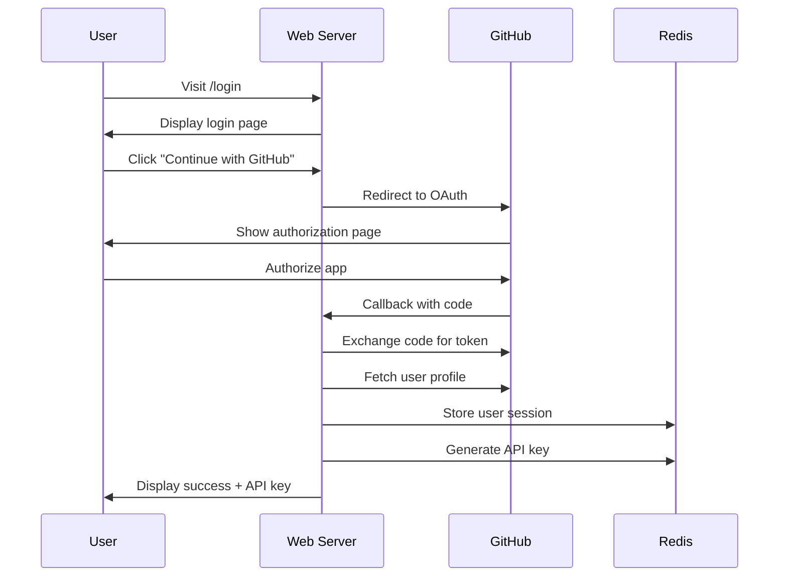

# 🔐 GitHub OAuth Integration for MCP Server

## Overview

The MCP Server now includes GitHub OAuth authentication, providing a seamless developer experience with automatic API key generation based on GitHub profiles.

## 🚀 Quick Start

### 1. GitHub App Setup

Create a GitHub OAuth App at https://github.com/settings/applications/new:

- **Application name**: "Django Vue MCP Documentation Server"
- **Homepage URL**: `http://localhost:8000` (development) or `https://mcp.gojjoapps.com` (production)
- **Authorization callback URL**: `http://localhost:8000/auth/github/callback` (development) or `https://mcp.gojjoapps.com/auth/github/callback` (production)

### 2. Environment Configuration

Copy the OAuth environment template:
```bash
cp .env.oauth.example .env.oauth
```

Configure your OAuth settings:
```bash
# GitHub OAuth App Credentials
GITHUB_CLIENT_ID=your_github_client_id_here
GITHUB_CLIENT_SECRET=your_github_client_secret_here

# Server Configuration
BASE_URL=http://localhost:8000
WEB_PORT=8000
HEALTH_PORT=8080

# Enable OAuth web mode
HTTP_MODE=true
DOCKER_MODE=false

# Redis Configuration
REDIS_URL=redis://localhost:6379
REDIS_PASSWORD=your_redis_password_here

# JWT Secret for sessions
JWT_SECRET=your_jwt_secret_32_characters_minimum_length
```

### 3. Start Development Server

```bash
./start-oauth-dev.sh
```

This script will:
- Validate configuration
- Start Redis if needed
- Install dependencies
- Launch the OAuth-enabled web server

### 4. Test OAuth Flow

1. Visit http://localhost:8000
2. Click "Continue with GitHub"
3. Authorize the application
4. Receive your API key and access dashboard

## 🏗️ Architecture

### OAuth Flow



### Role Assignment Logic

Users are automatically assigned roles based on their GitHub profile:

| Criteria | Role | Rate Limit |
|----------|------|------------|
| `public_repos >= 10` OR `followers >= 50` OR has `company` | **Premium** | 5,000 req/hour |
| `public_repos >= 5` | **Developer** | 10,000 req/hour |
| Default | **Basic** | 1,000 req/hour |
| Admin (manual) | **Admin** | Unlimited |

### Session Management

- Sessions stored in Redis with 30-day expiration
- Automatic API key generation and association
- Secure session tokens with CSRF protection
- Automatic cleanup of expired sessions

## 🎛️ Developer Dashboard

The dashboard provides comprehensive analytics and management:

### Features

- **Usage Analytics**: Real-time and historical request tracking
- **Rate Limit Monitoring**: Current usage vs. limits with visual indicators
- **API Key Management**: View, copy, and manage API keys
- **Integration Examples**: Code snippets for quick setup
- **Usage Charts**: 24-hour request history with Chart.js

### Dashboard Sections

1. **Usage Statistics Cards**
   - Current hourly usage
   - Total requests (24h)
   - Access level badge
   - Active API keys count

2. **API Key Management**
   - Full API key display with copy button
   - Key metadata (role, type, created date, usage count)
   - Status indicators

3. **Usage Analytics**
   - Interactive charts showing request patterns
   - Historical data for the last 24 hours
   - Usage percentage indicators

4. **Integration Guide**
   - Environment variable setup
   - cURL testing commands
   - Claude Code MCP client configuration

## 🔧 Configuration Options

### Environment Variables

| Variable | Description | Default |
|----------|-------------|---------|
| `GITHUB_CLIENT_ID` | GitHub OAuth app client ID | Required |
| `GITHUB_CLIENT_SECRET` | GitHub OAuth app secret | Required |
| `BASE_URL` | Server base URL for callbacks | `http://localhost:8000` |
| `HTTP_MODE` | Enable web interface mode | `false` |
| `WEB_PORT` | Web server port | `8000` |
| `HEALTH_PORT` | Health check port | `8080` |
| `REDIS_URL` | Redis connection URL | `redis://localhost:6379` |
| `JWT_SECRET` | Session signing secret | Random 32+ chars |

### Security Configuration

- **PKCE Flow**: Uses Proof Key for Code Exchange for enhanced security
- **State Parameter**: CSRF protection with cryptographically secure tokens
- **IP Validation**: Optional IP whitelisting for premium/developer tiers
- **Session Security**: Secure session tokens with Redis backing
- **Rate Limiting**: Per-role rate limits with burst protection

## 🐳 Docker Deployment

### Development

```bash
# Start with OAuth enabled
docker-compose up --build
```

### Production

```bash
# Deploy secure OAuth-enabled server
docker-compose -f docker-compose.secure.yml up -d
```

The Docker configuration automatically:
- Starts in HTTP_MODE for OAuth
- Configures secure networking
- Enables health checks
- Sets up Redis persistence
- Applies security hardening

## 📊 Monitoring & Analytics

### User Metrics

Track user engagement and API usage:
- GitHub profile metadata (repos, followers, company)
- Authentication success/failure rates
- API key generation and usage patterns
- Rate limit hit frequency

### System Metrics

Monitor OAuth system health:
- OAuth callback success rates
- Session creation/expiration rates  
- Redis connection status
- GitHub API response times

### Alerts

Configure monitoring for:
- High OAuth failure rates
- Unusual user registration patterns
- Redis connection issues
- GitHub API rate limits

## 🚀 Production Deployment

### GitHub App Configuration

For production deployment:

1. Update GitHub app settings:
   - Homepage URL: `https://mcp.gojjoapps.com`
   - Callback URL: `https://mcp.gojjoapps.com/auth/github/callback`

2. Configure environment:
   ```bash
   BASE_URL=https://mcp.gojjoapps.com
   HTTP_MODE=true
   ENVIRONMENT=production
   ```

3. SSL/TLS requirements:
   - Valid SSL certificate (Let's Encrypt)
   - HTTPS redirect configuration in Nginx
   - Secure session cookies

### Scaling Considerations

- **Redis Clustering**: For high-availability session storage
- **Load Balancing**: Multiple server instances behind Nginx
- **CDN Integration**: Static assets served via CDN
- **Database Migration**: Consider PostgreSQL for user data
- **Monitoring**: Comprehensive logging with structured output

## 🔍 Troubleshooting

### Common Issues

1. **OAuth Callback Error**
   - Verify callback URL matches GitHub app configuration
   - Check BASE_URL environment variable
   - Ensure server is accessible from GitHub

2. **Session Persistence Issues**
   - Verify Redis connection
   - Check session timeout configuration
   - Validate JWT_SECRET configuration

3. **Rate Limit Problems**
   - Monitor Redis rate limit keys
   - Check role assignment logic
   - Verify rate limit configurations

### Debug Mode

Enable detailed logging:
```bash
export LOG_LEVEL=DEBUG
python src/web_mcp_server.py
```

### Health Checks

Monitor system health:
```bash
# Basic health
curl http://localhost:8080/health

# Detailed health with OAuth status
curl http://localhost:8080/health/detailed

# Redis connection test
redis-cli ping
```

## 🧪 Testing

### OAuth Flow Testing

Test the complete OAuth flow:

```bash
# Start test server
./start-oauth-dev.sh

# Test endpoints
curl http://localhost:8000/login
curl -L http://localhost:8000/auth/github
```

### API Key Testing

Test generated API keys:

```bash
# Get API key from dashboard, then test
curl -H "X-API-Key: your_api_key_here" \
     http://localhost:8000/api/resources
```

### Load Testing

Test OAuth under load:

```bash
# Install artillery
npm install -g artillery

# Run OAuth load test
artillery run tests/oauth-load-test.yml
```

## 📚 Integration Examples

### Claude Code MCP Client

```bash
# Set environment
export MCP_API_KEY="your_api_key_from_dashboard"
export MCP_SERVER_URL="http://localhost:8000"

# Run MCP client
python src/mcp_http_client.py
```

### Direct API Access

```python
import httpx

# Initialize client
client = httpx.Client(
    base_url="http://localhost:8000",
    headers={"X-API-Key": "your_api_key_here"}
)

# Fetch resources
response = client.get("/api/resources")
resources = response.json()

# Get specific library info
django_info = client.get("/api/resources/django/current-version")
print(django_info.json())
```

### JavaScript Integration

```javascript
const API_BASE = 'http://localhost:8000';
const API_KEY = 'your_api_key_here';

async function fetchDjangoVersion() {
    const response = await fetch(`${API_BASE}/api/resources/django/current-version`, {
        headers: {
            'X-API-Key': API_KEY
        }
    });
    
    const data = await response.json();
    console.log('Django version:', data);
}
```

## 🤝 Contributing

### Development Setup

1. Fork the repository
2. Create feature branch
3. Configure OAuth for testing
4. Implement changes
5. Add tests
6. Submit pull request

### OAuth-specific Testing

When contributing OAuth features:
- Test with multiple GitHub accounts
- Verify role assignment logic
- Test session management edge cases
- Ensure security measures work correctly

---

**🎉 Ready to Go!** Your MCP server now provides a seamless OAuth experience for developers, with automatic API key generation and comprehensive usage analytics.